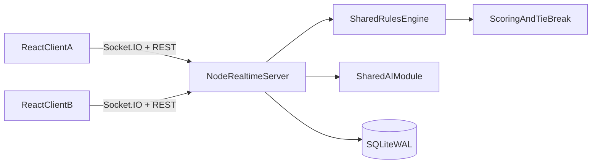

# Push Rummy Architecture

## System model

- **Authoritative server** validates every game action via the shared rules engine.
- **Clients** render state and send intents; they cannot force illegal transitions.
- **`@push-rummy/shared`** is the single source of truth for rules, scoring, and AI so server and client stay aligned.
- **Lobby and in-progress matches** are held in memory on the game server process (ephemeral across restart).

## High-level components

## Server responsibilities

- **HTTP:** register/login, profile, leaderboard, health, optional admin reset, static SPA in production.
- **Sockets:** room lifecycle (create/join/leave/seat config), game start, actions, continue between hands, room snapshots.
- **AI:** after each state change, runs automated seats until a human must act or the hand ends (bounded loop).
- **Persistence:** SQLite stores users, ratings, match summaries, and rating events. Only **completed** matches are finalized and rated (idempotent per `match_id`).

## Shared engine responsibilities

- Deck, deal, and 6-hand objective progression.
- Meld validation (`run` / `set`), wilds, push/draw/laydown/discard legality.
- Hand and match scoring with deterministic tie-breaks.
- AI move selection by difficulty.

## Client responsibilities

- Auth UI, leaderboard, profile.
- Room flow, seat editor, table UX, scorecard.
- Socket connection and optimistic UI feedback; errors from rejected actions.

## Data contracts

- **REST:** JSON; auth header `Authorization: Bearer <jwt>` where required.
- **Socket.IO:** ACK callbacks `(ok, payload)` for RPC-style events; `room:update` broadcasts authoritative state.

Core events include: `room:create`, `room:join`, `room:leave`, `room:setSeat`, `game:start`, `game:action`, `game:continue`, `room:get`, `room:update`.

## Deployment shapes

- **Development:** Vite on **5173**, API on **8787** (see root `README.md`).
- **Docker:** single image serves API + static client on container **8787**, typically mapped to host **9887** (see `docker-compose.yml`).

## Security and performance

- **`docs/SECURITY.md`** — secrets, CORS, admin, rate limits, TLS guidance.
- **`docs/PERFORMANCE.md`** — leaderboard scaling, in-memory lobby limits.

## Scale-up path

- Redis adapter (or similar) for multi-instance Socket.IO + shared room state.
- Optional event log for reconnect/replay.
- Stricter room codes or authenticated room subscriptions for public release.
- SQL-backed leaderboard pagination and indexes when user counts grow.

## Related docs

- **`docs/RULES.md`** — tabletop rules mirrored in code.
