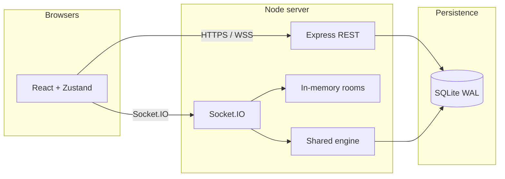

# Push Rummy — architecture

## System model

- **Authoritative server** validates every game action via the shared rules engine (`@push-rummy/shared`). Clients cannot apply illegal transitions.
- **`@push-rummy/shared`** is the single source of truth for rules, scoring, deck, and AI so the server and any client logic stay aligned.
- **Lobby and in-progress matches** live in an in-memory `Map` on the game server process (ephemeral across restart).
- **Persistence** (SQLite): users, passwords, ratings, match summaries, rating events. Only **completed** matches are finalized and rated.

## Repository layout

| Path | Role |
|------|------|
| `shared/src` | Deck, shuffle, rules (`validateMeld`, objectives, legal plays), `applyAction` state machine, scoring, AI |
| `server/src` | Express app, Socket.IO, `initDb`, leaderboard queries, `finalizeCompletedMatch`, optional static SPA |
| `client/src` | React UI, Zustand store (`store.ts`), Socket.IO client, Vite build |
| `docs/` | Architecture, gameplay, rules, security, performance |
| `tests/fixtures/` | Test assets (e.g. minimal SPA for server tests) |

## High-level components

## Match and hand lifecycle

### Match `status` (`MatchState`)

| Status | Meaning |
|--------|---------|
| `in_hand` | Active play; `hand` describes current deal, seats, phases |
| `between_hands` | Round summary shown; host must **continue** to deal next objective |
| `finished` | All six hands complete; winner determined; server may finalize ratings |

Lobby-only rooms (no `match` yet) are represented on the server as a **Room** with `match` undefined; the client sees `status: "lobby"`.

### Hand `turnPhase` (`HandState`)

| Phase | Typical player actions |
|-------|-------------------------|
| `draw_choice` | `choose_pickup` or `choose_push` |
| `action` | Lay down (if legal), `add_to_meld`, `replace_wild`, or discard if allowed |
| `discard_required` | Must `discard` a legal natural (or complete forced draws first) |
| `complete` | Hand over; winner set; scoring applied |

### Game actions (`GameAction` in `shared/src/game.ts`)

| Action | Purpose |
|--------|---------|
| `choose_pickup` | Take top discard into hand |
| `choose_push` | Push bundle to left neighbor per push rule, then draw |
| `laydown` | Table melds from hand (must satisfy current objective on first laydown) |
| `add_to_meld` | Add a card from hand to an existing table meld |
| `replace_wild` | Swap a natural from hand for a wild in a meld |
| `discard` | End turn by discarding (or go out if last card is a legal discard) |

All actions are validated in **`applyAction`**; invalid actions throw and the server surfaces the error to the client over the socket ACK.

## Server responsibilities

### HTTP

- `GET /health` — liveness + room count
- `POST /auth/register`, `POST /auth/login` — bcrypt + JWT (rate-limited)
- `GET /profile` — auth required; ratings + records + recent events
- `GET /leaderboard` — mode, sort, capped limit
- `POST /admin/reset-db` — optional; disabled unless `ADMIN_RESET_KEY` set
- Static files — if `CLIENT_DIST` (or adjacent `client/dist`) contains `index.html`, SPA fallback for non-API routes

### WebSocket (Socket.IO)

Connections are authenticated for mutating events via JWT in the payload; **`room:get`** is unauthenticated (room code is the secret).

| Event | Direction | Purpose |
|-------|------------|---------|
| `room:create` | C→S (+ ack) | Host creates room, joins socket to room id |
| `room:join` | C→S | Second+ human joins by code |
| `room:leave` | C→S | Leave lobby or finished match |
| `room:setSeat` | C→S | Host sets seat to open or AI + level |
| `game:start` | C→S | Build `MatchState`, run initial AI loop |
| `game:action` | C→S | Human `applyAction` |
| `game:continue` | C→S | Host advances `between_hands` → next hand |
| `room:get` | C→S | Snapshot for code |
| `room:update` | S→C | Broadcast `toPublicRoom(room)` after mutations |

After relevant events, the server runs **`autoRunAi`** (capped iterations) and **`finalizeIfFinished`** (when `status === "finished"`).

### AI

- Implemented in **`shared/src/ai.ts`**, invoked from the server after human actions and after **continue**.
- **`runAiTurn`** loops until the active seat is human, phase is `draw_choice`, or iteration cap — prevents infinite AI chains in one tick.

## Shared engine responsibilities

- **Deck:** double deck + four jokers; shuffle; deal 7; one card starts discard.
- **Objectives:** six hands in fixed order (`OBJECTIVES` in `game.ts`); requirements in `rules.ts` (`OBJECTIVE_REQUIREMENTS`).
- **Meld validation:** sets vs runs, wild assignments, no K-A-2 wrap.
- **Legality:** `legalDiscardCandidates` excludes wilds and naturals that must be played on the table.
- **Scoring:** `scoreHand` / `scoreValue`; `getWinners` + `breakTieByLatestHands` for match end.

## Client responsibilities

- **Zustand store** (`client/src/store.ts`): auth, `fetch` leaderboard/profile, Socket.IO connection, room mirror from `room:update`, toast errors.
- **UI:** lobby, seat editor, table (hands, melds, discard), scorecard, leaderboard panel, profile.
- **No authoritative rules** on the client — the UI reflects server state and sends intents.

## Data contracts

- **REST:** JSON; `Authorization: Bearer <jwt>` where required.
- **Socket.IO:** ACK callbacks `(payload)` with `{ ok, error?, ... }`; broadcasts use `room:update`.

## Ratings pipeline

- On **`finished`**, `finalizeCompletedMatch` (idempotent per `match_id`) writes match row, participants, updates Elo-style ratings and win/loss counters, inserts rating events.
- Env tunables: `RATING_K_FACTOR`, `RATING_AI_WEIGHT` (see `server/src/ratings.ts`).

## Deployment shapes

- **Development:** Vite **5173**, API **8787** (see root `README.md`).
- **Docker:** single process serves API + static client on **8787**, often mapped to host **9887** (`docker-compose.yml`).

## Security and performance

- **`docs/SECURITY.md`** — secrets, CORS, TLS, admin, rate limits.
- **`docs/PERFORMANCE.md`** — leaderboard cost, AI bounds, horizontal scaling caveats.

## Scale-up path

- Redis adapter (or similar) for multi-instance Socket.IO + shared room state.
- Sticky sessions or shared store for rooms if horizontally scaled.
- SQL indexes / pagination for leaderboard at large user counts.
- Optional CSP split: static CDN + API-only server.

## Related docs

- **`docs/GAMEPLAY.md`** — player-facing flow.
- **`docs/RULES.md`** — rules mirrored in code.
